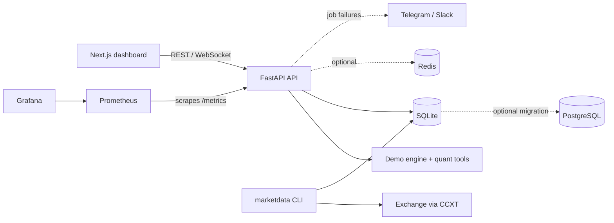

# QX-Core (Demo)

[](https://github.com/dvilmar/QX-Core-demo/actions/workflows/ci.yml)


A full-stack platform for systematic trading research and monitoring: a FastAPI backend, a Next.js dashboard with live WebSocket updates, a cost-aware backtester with a statistical validation battery, a market-data pipeline, and the operational tooling around them (metrics, health checks, kill switch, alerts, auth, backups).

> **This is a portfolio demo of a private project.** The real strategies, their research and live market data are not included. The signal here is a plain EMA20/EMA50 crossover with an RSI filter, running on seeded synthetic prices. It has no edge, and the validation tools are expected to say so. The repo exists to show the surrounding engineering, not trading logic.

## Contents

- [Features](#features)
- [Architecture](#architecture)
- [Quick start](#quick-start)
- [Configuration](#configuration)
- [API reference](#api-reference)
- [Backtesting and validation](#backtesting-and-validation)
- [Market-data pipeline](#market-data-pipeline)
- [Observability and operations](#observability-and-operations)
- [Security](#security)
- [Development](#development)
- [Project layout](#project-layout)
- [Limitations](#limitations)
- [License](#license)

## Features

| Area | What it does |
|---|---|
| **API** | REST and WebSocket in FastAPI, async job queue (start, then poll), persisted run history |
| **Backtesting** | Fee plus ATR-scaled slippage on every fill, no look-ahead (signals use bar `t-1`, fills at the open of `t`) |
| **Validation** | Walk-forward analysis, deflated Sharpe ratio, Monte Carlo trade resampling |
| **Data** | CCXT OHLCV download, SQLite store, data-quality report, SQLite to PostgreSQL migration |
| **Operations** | Prometheus metrics, engine heartbeats, aggregate `/health`, JSON logs, kill switch, Telegram/Slack alerts |
| **Scaling** | Optional Redis job store and leader-published snapshot for multi-worker runs |
| **Security** | API-key auth and/or session login (PBKDF2, signed HttpOnly cookie, rate limit) |
| **Dashboard** | Candlesticks, equity curve, trades, backtest lab, validation tab, login form |
| **Quality** | 67 tests (~92% coverage), ruff, mypy, pre-commit, GitHub Actions CI |

## Architecture



## Quick start

### With Docker

```bash
docker compose up --build
```

| Service | URL |
|---|---|
| Dashboard | http://localhost:3010 |
| API and docs | http://localhost:8010, http://localhost:8010/docs |

No API keys and no external services are needed: the backend generates its dataset in memory, so it works offline.

Optional services live in separate Compose files and refuse to start without their password:

```bash
# Prometheus :9090 and Grafana :3001
export GRAFANA_ADMIN_PASSWORD=<choose-a-password>
docker compose -f docker-compose.yml -f docker-compose.monitoring.yml up -d

# PostgreSQL, Redis and rotating pg_dump backups
export POSTGRES_PASSWORD=<choose-a-password>
docker compose -f docker-compose.yml -f docker-compose.data.yml up -d
```

### Without Docker

```bash
# backend
cd backend
python3 -m venv .venv && .venv/bin/pip install -r requirements-dev.txt
.venv/bin/uvicorn main:app --reload

# frontend (second terminal)
cd frontend
npm install
NEXT_PUBLIC_API_BASE=http://localhost:8000 npm run dev
```

## Configuration

Everything is optional. Copy [`.env.example`](.env.example) to `.env` to set any of these.

| Variable | Purpose | Default |
|---|---|---|
| `CORS_ORIGINS` | Allowed browser origins, comma separated | `http://localhost:3000` |
| `DASHBOARD_API_KEY` | Require `X-API-Key` (and `?api_key=` on the WebSocket) | off |
| `DASHBOARD_ADMIN_USER`, `DASHBOARD_ADMIN_PASSWORD_HASH`, `DASHBOARD_SESSION_SECRET` | Enable session login (all three required) | off |
| `DASHBOARD_COOKIE_SECURE` | Set the `Secure` flag on the session cookie | `1` (`0` in the Compose file) |
| `QX_DATA_DIR` | Directory for the database, heartbeats and kill-switch file | `data` |
| `QX_DB_PATH` | SQLite file | `<QX_DATA_DIR>/qx.db` |
| `QX_LOG_DIR` | Write JSON logs here, rotated daily | off |
| `QX_STALE_AFTER_S` | Heartbeat age after which an engine is reported stale | `60` |
| `REDIS_URL` | Enable the shared job store and snapshot hub | off |
| `DATABASE_URL` | Target PostgreSQL for the migration script | none |
| `TELEGRAM_BOT_TOKEN`, `TELEGRAM_CHAT_ID`, `SLACK_WEBHOOK_URL` | Alerts on job failures | off |
| `NEXT_PUBLIC_API_BASE`, `NEXT_PUBLIC_API_KEY` | Frontend build-time API address and key | `http://localhost:8000`, none |

To enable the login, generate a password hash and put it in `.env` between single quotes, because it contains `$`:

```bash
cd backend && python auth_session.py
```

## API reference

| Method | Path | Purpose |
|---|---|---|
| `GET` | `/health` | Aggregate status of API, database, Redis, kill switch and engine heartbeats (`degraded` if stale or halted) |
| `GET` | `/metrics` | Prometheus metrics |
| `POST` | `/api/auth/login`, `/api/auth/logout` | Session login and logout |
| `GET` | `/api/auth/verify` | Check the session cookie |
| `GET` | `/api/snapshot`, `/api/candles`, `/api/trades` | Current state of the demo engine |
| `POST` | `/api/backtest/run` | Start a backtest job, returns a `job_id` |
| `GET` | `/api/backtest/run/{job_id}` | Poll a backtest job |
| `POST` | `/api/validation/run` | Start the validation battery |
| `GET` | `/api/validation/run/{job_id}` | Poll a validation job |
| `GET` | `/api/runs` | History of finished jobs |
| `GET`, `POST` | `/api/halt` | Read or trip the kill switch |
| `POST` | `/api/resume` | Clear the kill switch |
| `WS` | `/api/ws` | Live snapshot push |

Interactive docs are served at `/docs`.

## Backtesting and validation

The code lives in [`backend/quant`](backend/quant).

- **Costs** (`costs.py`): a proportional fee on every fill plus slippage of `max(floor, k * ATR / close)`.
- **Metrics** (`metrics.py`): CAGR, volatility, Sharpe, Sortino, Calmar, max drawdown, VaR/CVaR, profit factor, win rate.
- **Walk-forward** (`walkforward.py`): expanding windows. The best candidate is picked in-sample and scored on the unseen window that follows, with an embargo between them.
- **Deflated Sharpe ratio** (`statistics.py`): corrects the winner's Sharpe for the number of candidates that were tried.
- **Monte Carlo** (`monte_carlo.py`): bootstraps the trade list into return and drawdown percentiles and a probability of loss.

The **Validation** tab (or `POST /api/validation/run`) runs the whole battery over a small EMA grid on synthetic data. The same code accepts real candles:

```python
from marketdata import store
from quant.adapters import frame_to_candles
from quant.validation_runner import run_validation

candles = frame_to_candles(store.load_candles("BTC/USDT", "1h"))
report = run_validation(candles)
```

On random or near-random data the out-of-sample folds are mixed and the deflated Sharpe stays low. That is the intended outcome for a strategy without an edge.

## Market-data pipeline

The code lives in [`backend/marketdata`](backend/marketdata).

```bash
cd backend
python -m marketdata.cli fetch --symbol BTC/USDT --timeframe 1h --days 90
python -m marketdata.cli quality --symbol BTC/USDT --timeframe 1h
```

- Paginated OHLCV download through CCXT using public endpoints, dropping the bar still forming.
- SQLite store with upserts.
- Quality report: duplicates, missing bars, invalid OHLC relations and non-positive prices.
- `migrate_to_postgres.py` copies the store to PostgreSQL. It refuses to overwrite without `--replace` and verifies row counts after the copy. Set `DATABASE_URL` to your connection string, and use `--dry-run` to preview.

## Observability and operations

| Capability | Details |
|---|---|
| **Metrics** | `qx_api_http_requests_total`, `qx_api_http_request_duration_seconds`, `qx_equity_usd`, `qx_last_tick_age_seconds`, `qx_ws_clients`, `qx_jobs_total`, `qx_job_duration_seconds` |
| **Heartbeats** | Each engine writes a small JSON file. The age is measured at scrape time, and a CLI exits non-zero when it is stale (`python -m observability.health <engine> --max-age 60`), which the Docker `HEALTHCHECK` uses |
| **Kill switch** | A `.HALT` sentinel file pauses the engine and marks `/health` as degraded. Control it through `/api/halt` and `/api/resume` |
| **Logs** | Structured JSON with daily rotation when `QX_LOG_DIR` is set |
| **Alerts** | Telegram and Slack notifications when a background job fails |
| **Grafana** | A provisioned "Algo Dashboard — Health" dashboard with request rate, latency, jobs, equity and heartbeat age |
| **Backups** | `infra/postgres/backup.sh` takes rotating `pg_dump` backups of the optional PostgreSQL service |
| **Multi-worker** | With `REDIS_URL` set, job state lives in Redis and one elected worker publishes the snapshot that every worker serves |

## Security

- Access is **open by default**. Set `DASHBOARD_API_KEY` and/or the `DASHBOARD_ADMIN_*` variables to protect `/api/*` and the WebSocket.
- Session login uses PBKDF2-SHA256 password hashing, an HMAC-signed `HttpOnly` `SameSite=Strict` cookie, and a limit of 5 failed attempts per 5 minutes per IP.
- The API key and the session cookie work together: either one grants access.
- `/health` and `/metrics` are intentionally unauthenticated so probes and Prometheus can reach them. Keep them off the public internet.
- The optional Compose files have no default passwords: they fail until you provide one.
- GitHub vulnerability alerts and Dependabot security updates are enabled for the repository.

## Development

```bash
# backend
cd backend
pip install -r requirements-dev.txt
pytest --cov=.
ruff check . && ruff format --check .
mypy .

# frontend
cd frontend
npx tsc --noEmit && npm run lint && npm run build

# optional: run the checks on every commit
pip install pre-commit && pre-commit install
```

[GitHub Actions](.github/workflows/ci.yml) runs the backend (ruff, mypy, pytest) and the frontend (tsc, eslint, build) on every push and pull request.

## Project layout

```
backend/
  main.py             app entrypoint, middleware, /health
  routes.py           REST and WebSocket endpoints, async job pattern
  demo_engine.py      synthetic data and the demo EMA/RSI backtest
  auth.py             API-key and session access control
  auth_session.py     password hashing, signed tokens, login rate limit
  auth_routes.py      login, logout and verify endpoints
  redis_store.py      optional shared job store and snapshot hub
  alerts.py           Telegram and Slack notifier
  quant/              costs, metrics, walk-forward, deflated Sharpe, Monte Carlo
  marketdata/         CCXT provider, SQLite store, quality checks, Postgres migration
  observability/      Prometheus metrics, heartbeats, kill switch, JSON logging
  tests/              pytest suite
frontend/
  src/app/            Next.js App Router page and layout
  src/components/     charts, KPIs, trades table, backtest and validation labs, login
  src/lib/api.ts      typed REST and WebSocket client
infra/
  monitoring/         Prometheus config and provisioned Grafana dashboard
  postgres/           scheduled pg_dump backup script
docker-compose.yml             API and dashboard
docker-compose.monitoring.yml  Prometheus and Grafana
docker-compose.data.yml        PostgreSQL, Redis and backups
```

## Limitations

- Prices are synthetic and the signal has no edge. Results show the tooling, not a tradable strategy.
- The API's backtest and validation jobs run on synthetic data. Real candles go through the CLI and the Python snippet above.
- Without `REDIS_URL`, job state lives in process memory and is lost on restart. Run history persists in SQLite.
- The live "engine" moves a synthetic price; there is no exchange connection or order execution.
- The kill switch pauses the demo engine only. Wire it into real execution before relying on it.

## License

[MIT](./LICENSE)
